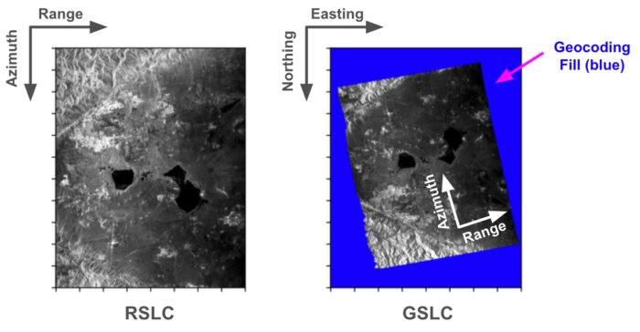

# Introduction

For the NASA-ISRO Synthetic Aperture Radar (NISAR) mission (https://nisar.jpl.nasa.gov/), the NASA Science Data System (SDS) will produce global Quality Assurance (QA) products for Level-1 (L1) and Level-2 (L2) L-band science data products. The QA products will contain quality metrics, summary statistics, and plots of science data; they will be distributed publicly and freely through the NASA Alaska Satellite Facility Distributed Active Archive Center alongside the L1 and L2 products.

These QA parameters will provide the scientific community with a comprehensive perspective on the quality of NISAR products at a global scale and enable efficient analysis without the need to download extensive L1/L2 science data.

## Overview of NISAR QA

### How will QA outputs be generated during NISAR mission operations?

NISAR SDS at JPL will run the QA software at scale on each L1 and L2 science data granule produced as part of the baseline mission processing. Faulty granules can be flagged and prevented from being uploaded.

### Open Source Software and Documentation

The NISAR QA software is available open-source at https://github.com/isce-framework/nisarqa.

The `nisarqa` respository documents the development and release history of the QA software. It is also hosts the source of the QA Product Specification documentation, which is used to generate the official, signed release versions of the QA Product Specification document by the NISAR mission.

For the most-current version of the content of these documents, please visit the open-source respository.

However, as the QA software evolves, the product specifications will also evolve. The QA software version used to generate a given set of QA outputs can be found on the cover page of the QA report PDF file and in the QA Statistics HDF5 file's `/science/LSAR/QA/processing/QASoftwareVersion` dataset. This version number corresponds to a specific QA software tag: https://github.com/isce-framework/nisarqa/tags. Each tagged version implicitly include a snapshot of the product specifications at the time of that tag.

### NISAR QA Output Product Descriptions (Overview)

One set of QA products will be generated for each L1 and L2 L-band science data granule. Due to the differing content of each L1 and L2 science product type, the specific content of each QA output file is customized for input file type, and will be detailed in later sections. (For example, L2 GUNW granules contain interferogram layers, which L1 RSLC granules do not contain.) This table provides a description of the individual files in a set of QA products:

| File Type | Filename* | Description | Approx. Size |
| :---: | :----------- | -------------- | ----- |
| PNG | `<gran_id>.png` | Browse Image  | < 10 MB |
| KML | `<gran_id>.kml` | Geolocation sidecar file for the PNG | < 5 KB |
| PDF | `<gran_id>_QA_REPORT.pdf` | Graphical summary of the input product, including plots, histograms, and other assessments | < 3 MB |
| HDF5 | `<gran_id>_QA_STATS.h5` | HDF5 containing statistics, metrics, histograms, identification information, and more about the datasets in the input granule. Also includes QA processing parameters | 1-10 MB |
| CSV | `<gran_id>_QA_SUMMARY.csv` | High level PASS/FAIL checks | < 5 KB |
| TXT | `<gran_id>_QA_LOG.txt` | Log file. Contains full details of verification checks, in addition to typical log outputs | < 200 KB |

\* For NISAR mission processing, `<gran_id>` will be the complete granule ID of the input L1/L2 product.

## Input NISAR L1/L2 Science Product Overview
Each NASA SDS L0-L2 L-band product is distributed as a single Hierarchical Data Format version 5 granule. For full descriptions, please see the L1/L2 product specification documents, 
currently available from the sample data website https://nisar.jpl.nasa.gov/data/sample-data/ .

### NISAR product level descriptions defined by Science:

| Data Level | Description |
| :----: | ----------------- |
| Level 0A | Unprocessed instrument data with some communications artifacts removed, but without reconstruction of missing data and reordering of samples from the instrument. May still contain bit errors and missing data that needs reconstruction. |
| Level 0B | Reconstructed, time-ordered unprocessed instrument data at original resolution, time ordered, all communications artifacts removed. |
| Level 1 | Processed instrument data, focused to full resolution complex images or derived radar parameters including interferometric phase and pixel offsets, in native radar coordinates system. |
| Level 2 | Focused radar imagery or derived radar parameters projected to a map coordinate system. |
| Level 3 | Derived geophysical parameters on geocoded grids with the same or coarser posting as Level 1 or Level 2 products. |

### NISAR L0-L2 Science Product Dependency Graph

NISAR Quality Assurance software is designed to verify and assess the quality of the eight NISAR L-band L1 and L2 products, nominally generated using the ISCE3 software (https://github.com/isce-framework/isce3). The dependency graph and brief descriptions of each L1/L2 product are below, which illustrates the chain of upstream-to-downstream science products. This is useful because errors revealed via the QA reports for a downstream product can sometimes have their root cause traced back to the upstream input product. For example, if a user sees a concern in a GUNW product's QA report, they might consider looking at the upstream RIFG and RSLC QA reports for insight.

### NISAR L1 and L2 Science Product Descriptions

| Level | Acronym | Product | Description |
| :---: | ---- | --------- | ----------------- |
| 1 | RSLC | Range-Doppler Single Look Complex (SLC) | The L1 RSLC product contains focused SAR images in range-Doppler coordinates. The RSLC is an input to other L1 or L2 products. |
| 1 | RIFG | Range-Doppler Nearest-Time Interferogram | Multi-looked interferogram in Range Doppler coordinates, ellipsoid and topographic phase flattened and formed with precise coregistration using geometrical offsets and high-resolution pixel offsets obtained from incoherent cross correlation. |
| 1 | RUNW | Range-Doppler Nearest-Time Unwrapped Interferogram | Multi-looked, ellipsoid and topography flattened unwrapped interferogram in Range Doppler coordinates. |
| 1 | ROFF | Range-Doppler Nearest-Time Pixel Offsets | Unfiltered and unculled layers of pixel offsets in Range Doppler coordinates with different resolutions obtained from incoherent cross correlation. |
| 2 | GSLC | Geocoded SLC | Single Look Complex SAR image on geocoded map coordinate system. |
| 2 | GCOV | Geocoded Polarimetric Covariance Matrix | Geocoded, multi-looked polarimetric covariance matrix. |
| 2 | GUNW | Geocoded Nearest-Time Unwrapped Interferogram | Geocoded, multi-looked, ellipsoid and topography flattened unwrapped interferogram |
| 2 | GOFF | Geocoded Nearest-Time Pixel Offsets | Unfiltered and unculled layers of pixel offsets in with different resolutions obtained from incoherent cross correlation and geocoded on map coordinate system. |

### L1 Range-Doppler products vs. L2 Geocoded products

The L1 products' acronyms begin with the letter "R" are on the range-Doppler (radar) grid; the L2 products' acronyms begin with the letter "G" and are geocoded.

In practise, this means when viewing the QA report PDFs, the L1 products' rasters will extend to the axes of the plots, while the L2 products' rasters will appear as a transformed version of the radar grid's image surrounded by geocoding fill. For the backscatter image plots in GSLC and GCOV PDFs, the backscatter fill is colored blue; elsewhere it appears translucent, white, or another color as appropriate.

## How to Use this Documentation
Because of the similarities among the L1 and L2 products and the output QA files generated, for brevity this documentation will not necessarily include images and descriptions of each L1 or L2 product type's QA outputs.

Instead, this documentation is structured first by QA output file type, and then by QA feature or input dataset assessed. Under each feature's section and in the subsection heading, it is noted which L1 or L2 product type(s) are relevant to feature.

Example output images or tables will be provided for each of each QA feature. If multiple L1 or L2 product types leverage the same feature, there will not necessarily be sample outputs for all product types, unless there are key differences to highlight beyond the basics.

