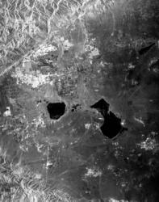
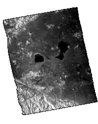
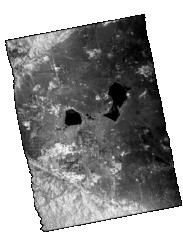
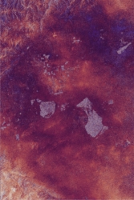
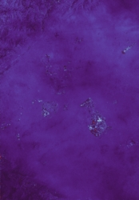
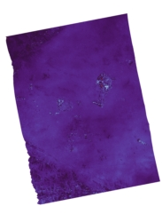
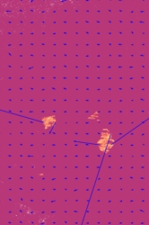
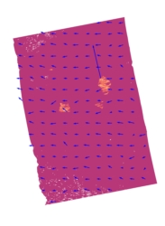

# Browse Products (PNG + KML)

## Overview
The browse images are designed to provide an intuitive representation and visualization of the science content of an input L1/L2 granule. During generation of the PNGs, image processing is applied to meets these goals; unlike the source L1/L2 science data products, the PNG's pixel values should not be used for analysis. PNGs are either grayscale or RBGA, with transparency.

Each PNG is accompanied by a sidecar KML file which contains approximate latitude/longitude coordinates of the four corners of the PNG for use in GIS software. Note that for L2 geocoded products, the four corners correspond (approximately) to the four corners of the entire raster, including the geocoding fill area.

## RSLC and GSLC Browse Image
RSLC and GSLC browse images are generated from the SLC imagery layer(s). The imagery layer(s) are multilooked and image processed to produce the final PNG; the algorithm used is described in the Report PDF: Backscatter Images section.

RSLC and GSLC browse images are either grayscale or RGBA. Layer(s) used are selected based on the mode and contents of the input product, per the following strategy:

* Single Pol (SP) products:
    - SP products contain only one imagery layer; this will be plotted in grayscale.
* Dual-Pol (DP) and Quasi-Quad (QQ) products:
    - All imagery layers for the PNG will come from a single frequency; Frequency A has priority over Frequency B.
    - Within that prioritized frequency, the available co-pol layer ("HH" or "VV") will be assigned to the red and blue channels, and the cross-pol layer ("HV" or "VH") will be assigned to the green channel.
* Quad-Pol (QP) products:
    - All imagery layers for the PNG will come from a single frequency; Frequency A has priority over Frequency B.
    - Within that prioritized frequency, the "HH" layer will be assigned to the red channel, the "HV" layer will be assigned to the green channel, and the "VV" layer will be assigned to the  blue channel.
* Quasi-Dual (QD) products:
    - QD products have equal bandwiths for Frequency A and Frequency B images, allowing layers across the two frequency groups to be easily combined.
    - From Frequency A, the "HH" layer is assigned to the red and blue channels. From Frequency B, the "VV" layer is assigned to the green channel.
* Compact-Pol (CP) products:
    - For Frequency A, a grayscale image will be produced for one layer, using prioritization order: ['RH','RV','LH','LV']
* If none of the above cases are met (such as for an off-nominal product configuration), then a grayscale image of one of the available imagery layers is produced.

A reduced-size copy of the individual image(s) used to form the browse image is plotted in the `REPORT.pdf`, where details about the coordinates, colorbar, and more can be found.

Sample RSLC Browse Image, from ALOS-1 derived data:



Sample GSLC Browse Image, from ALOS-1 derived data:




## GCOV Browse Image
GCOV browse image are either grayscale or RGBA PNGs. Layer(s) used are selected based on the mode and contents of the input product, per the following strategy:

* Only on-diagonal term layers will be used to create the browse image. 
* All imagery layers for the PNG will come from a single frequency; Frequency A has priority over Frequency B. 
* If only one imagery layer is available, it will be plotted in grayscale.
* If multiple imagery layers are available, color channels will be assigned with this algorithm:
    - Red channel: first available co-pol term in the list [HHHH, VVVV]
    - Green channel: first in the list [HVHV, VHVH, VVVV]
    - Blue channel:
        - If Green is VVVV, then HHHH is assigned to the blue channel.
        - Else the blue channel is assigned by the first co-pol of the list [VVVV, HHHH].
 * If none of the above cases are met (such as for GCOVs with only an HVHV term), then a grayscale image of one of the available imagery layers is produced.

A reduced-size copy of the individual image(s) used to form the browse image is plotted in the `REPORT.pdf`, where details about the coordinates, colorbar, and more can be found.

Sample GCOV Browse Image, from ALOS-1 derived data:




## RIFG Browse Image
RIFG browse image are RGBA PNGs; they are generated from the Unwrapped Interferogram Layer. A reduced-size copy of this image is plotted in the `REPORT.pdf`, where details about the coordinates, colorbar, and more can be found.

Sample RIFG Browse Image, from ALOS-1 derived data:




## RUNW and GUNW Browse Image
RUNW and GUNW browse images are RGBA PNGs; they are generated from the Wrapped Phase Image Layer which has been re-wrapped to the interval [0, 7pi). A reduced-size copy of this image is plotted in the `REPORT.pdf`, where details about the coordinates, colorbar, and more can be found.

Sample RUNW Browse Image, from ALOS-1 derived data:



Sample GUNW Browse Image, from ALOS-1 derived data:




## ROFF and GOFF Browse Image
ROFF and GOFF browse images are RGBA PNGs; they are generated by combining the Along Track Offsets and Slant Range Offsets layers from one of the `layerX` groups into a single image, overlaid with quiver-plot arrows to for quick visualization of the magnitude and direction of movement in the scene.

In the ROFF and GOFF offsets products, there are one or more layer groups (e.g. `layer1`, `layer2`, etc.). Each layer group was processed with a unique algorithm combination, which strikes a unique balance between the amount of noise and the coarseness of the granularity. The priorizitation order for the selecting which layer group to use for the browse image is 3, 2, 1, 4, 5, 6, 7.

A reduced-size copy of this image is plotted in the `REPORT.pdf`, where details about the coordinates, colorbar, and more can be found.

Sample ROFF Browse Image, from ALOS-1 derived data:



Sample GOFF Browse Image, from ALOS-1 derived data:




## KML Description (All Products)

Here are the contents of an example RSLC KML file. The KML file contains an `<href>` to the filename (along a relative path) of the corresponding PNG. For the nominal KML to recognize the PNG, both the PNG and KML  files must be in the same directory, and the `<href>` must match exactly the PNG's filename. If the PNG is moved and/or renamed, then the KML must be updated with the corresponding relative filepath to and/or filename of the PNG.

```xml
<?xml version="1.0" encoding="UTF-8"?>
<kml xmlns:gx="http://www.google.com/kml/ext/2.2">
  <Document>
    <name>overlay image</name>
    <GroundOverlay>
      <name>overlay image</name>
      <Icon>
        <href>NISAR_L1_PR_RSLC_002_030_A_019_2800_SHNA_A_20081127T061000_20081127T061014_D00404_N_F_J_001.png</href>
      </Icon>
      <gx:LatLonQuad>
        <coordinates>-118.443358591367,35.1738498508456 -117.69035266745301,35.2987616488343 -117.48091814387199,34.4452695936409 -118.227783291052,34.3202637394113</coordinates>
      </gx:LatLonQuad>
    </GroundOverlay>
  </Document>
</kml>
```
