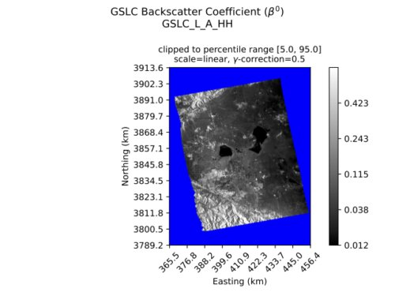
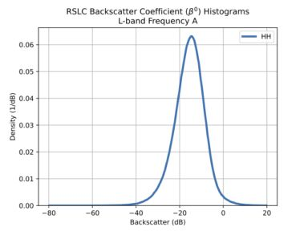
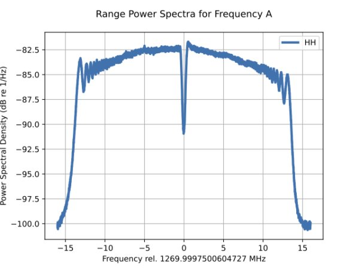
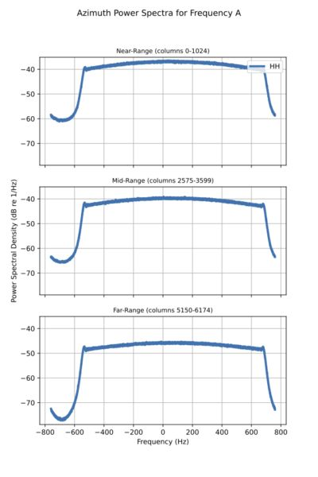

## Single-Input Products (RSLC, GSLC, GCOV)

### Backscatter Image (RSLC, GSLC, GCOV)

Each backscatter raster in the input product is individually processed and plotted in the PDF, using this strategy:

* **Step 1:** Convert raster to power in linear units, if needed.
    - RSLC and GSLC: the SLC rasters are converted via:
        * $power = abs(`magnitude`)^2$
    - GCOV: no conversion needed, but on- and off-diagonal rasters are prepped via:
        * $power = abs(`magnitude`)$

* **Step 2:** Multilook the raster

    - The number of looks used for the multilooking window is computed dynamically based on the shape of the input raster, the requested maximum size of the browse image PNG, and the pixel spacing of the raster. Ultimately, the number of looks is optimized to maximize the PNG resolution while staying within mission requirements, and generate multilooked images have roughly-square pixels.

    - The source raster is truncated to a shape which is integer multiples of the number of looks.

* **Step 3:** Apply image correction, if requested.

    - Image correction is dynamically applied to individual rasters, in the following order:
        
        - **Step 3i:** If requested, clip the raster's outliers to the requested percentile interval.
        
        - **Step 3ii:** If requested, convert from linear units to dB
        
        - **Step 3iii:** If requested, apply gamma correction
        
            - Note: `vmin` and `vmax` used for the PDF's colorbar range are determined prior to the gamma correction step.
    
    - The image correction settings are shown on the PDF.

* **Step 4:** Output to files:
    
    - Browse PNG: The processed image array is ready for use in the PNG; see the Browse Products section of this document for details.
    
    - Report PDF: At this step, the processed image array is further multilooked to a size that fits nicely on the PDF plot such that no interpolation is required and the PDF's file size is reasonable. If requested in the runconfig, pixels containing fill value are colored e.g. blue.

Relevant processing parameters can be found in the QA HDF5 output file.

Example RSLC Backscatter Plot in the PDF:

Example GSLC Backscatter Plot in the PDF: 

Example GCOV Backscatter Plot in PDF: 

### Power Histogram (RSLC, GSLC, GCOV)

A histogram of the power is generated for backscatter rasters in the input product; the histogram is plotted in the QA PDF and its values stored in the QA HDF5, using this strategy:

* **Step 1:** Decimate the array per the decimation ratio in specified in the runconfig.
* **Step 2:** Discard non-finite pixels.
* **Step 3:** Convert pixels to power in linear units, if needed.
    - RSLC and GSLC: the SLC rasters are converted via:
        * $power = abs(`magnitude`)^2$
    - GCOV: no conversion needed, but on- and off-diagonal rasters are prepped via:
        * $power = abs(`magnitude`)$
* **Step 4:** Convert from linear units to decibel.
* **Step 5:** Clip the array so that it falls within the bounds of the histogram.
* **Step 6:** Compute the histogram counts.
* **Step 7:** If requested, process counts to probability densities.
* **Step 8:** Output to files:
    - Report PDF: The histogram is plotted.
    - Stats HDF5: Relevant processing parameters, the histogram bins, and the computed densities (or counts), are stored.

For each frequency group in the input product, if multiple images are available then their power histograms will be plotted on the same figure in the PDF.

Example RSLC Backscatter Power Histogram in the PDF:

### Phase Histogram (RSLC, GSLC, GCOV off-diagonal)

A histogram of the phase is generated for imagery rasters in the input product. For GCOV, this plot is only included if there are off-diagonal covariance terms included in the input product. The histogram is plotted in the QA PDF and its values stored in the QA HDF5, using this strategy:

* **Step 1:** Decimate the array, per the decimation ratio in specified in the runconfig.
* **Step 2:** Discard zero-valued pixels and non-finite pixels.
* **Step 3:** Compute the phase in units of radians or degrees, as specified in the runconfig.
* **Step 4:** Compute the histogram counts.
* **Step 5:** If requested, process counts to probability densities.
* **Step 6:** Output to files:
    - Report PDF: The histogram is plotted.
    - Stats HDF5: Relevant processing parameters, the histogram bins, and the computed densities (or counts), are stored.

For each frequency group in the input product, if there are multiple images available then their phase histograms will be plotted on the same figure in the PDF.

Example RSLC Phase Histogram in the PDF:

### Range Power Spectra (RSLC)

For each frequency group in the input product, a range power spectra plot is provided. If there are multiple polarization images available in a frequency group then their range power spectra will be plotted on the same figure in the PDF. The arrays of the frequency bins and range power spectral density are stored in the QA HDF5.

By default, every 8th range line is used to compute the range spectra for computational efficiency. The actual decimation stride along the azimuth axis used to compute the range spectra can be found in the QA processing parameters in the QA HDF5.

Example RSLC Range Power Spectra in the PDF:

### Azimuth Power Spectra (RSLC)

For each frequency group in the input product, azimuth power spectra plots are provided. If there are multiple polarization images available in a frequency group then their azimuth power spectra will be plotted on the same figure in the PDF. The arrays of the frequency bins and azimuth power spectral density are stored in the QA HDF5.

Azimuth spectra will be computed by averaging contiguous range samples for each of near-, mid-, and far-range subswaths. These contiguous ranges sample subswaths are noted in the plots' subtitles, and in the QA HDF5.

Example RSLC Azimuth Power Spectra in the PDF:

