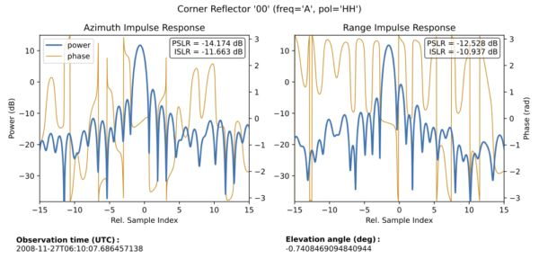
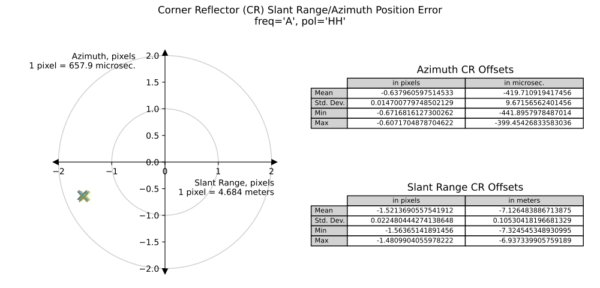

### Calibration Tools (RSLC, GSLC)

Three calibration tools will be run as part of nominal mission processing
for NISAR science products: The Noise Equivalent Backscatter (NEB) tool, 
the Point Target Analysis (PTA) tool, and the Absolute Radiometric 
Calibration (AbsCal) tool.

The NEB calibration tool is run during the L1 RSLC focusing workflow 
and its results stored in the L1 RSLC HDF5. These results are copied to 
the RSLC QA HDF5 file for ease of access by users.

When processing NISAR image granules over designated calibration sites, 
additional tools are run using corner reflector survey data:
* The PTA tool produces diagnostic plots and metrics 
related to image resolution, sidelobe levels, geometric accuracy, etc. 
in RSLC and GSLC products.
    - The PTA tool's outputs are stored in the report PDF and QA HDF5 file.
* The AbsCal tool estimates the radiometric calibration error of targets 
with known scattering properties in RSLC products.
    - The AbsCal tool's outputs are stored in the QA HDF5 file.

Downstream tools can collate results from multiple QA products to derive 
radiometric and geometric calibration parameters and monitor calibration 
stability over time.

#### Point Target Analysis Plots (RSLC, GSLC) (Optional)

Impulse response plots display power and phase cross-sections along 
azimuth (along-track) and range (cross-track) of corner reflectors 
in RSLC and GSLC image products, and provide metrics such as 
Peak-to-Sidelobe Ratio (PSLR) and Integrated Sidelobe Ratio (ISLR) 
for image quality assessment.

Sample impulse response plots in the PDF:

Corner reflector (CR) offsets scatterplots in QA reports measure the error 
between expected and apparent positions of surveyed targets in both 
range-Doppler and geocoded image products in order to calibrate azimuth 
and range delays and evaluate geolocation accuracy.

Sample CR offsets scatterplots in the PDF:

