## InSAR and Offsets Products (RIFG, RUNW, GUNW, ROFF, GOFF)

### Unwrapped Phase (RUNW, GUNW)

Example Unwrapped Phase plots and histogram in the PDF: 

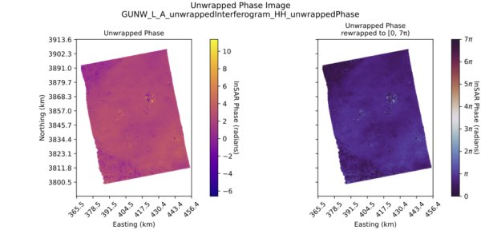

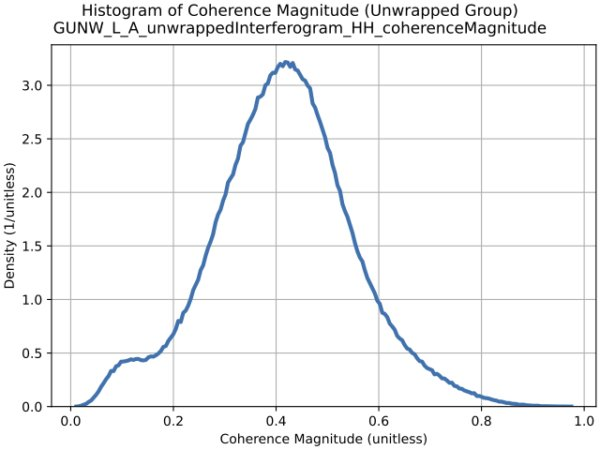

### Connected Components (RUNW, GUNW)

Example Connected Components plot and bar chart in the PDF: 

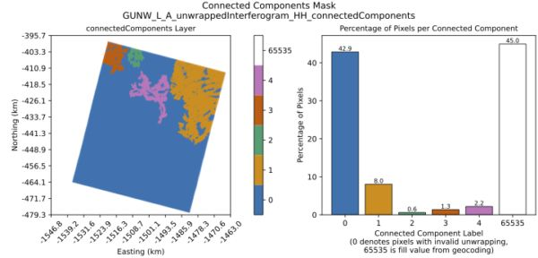

### Unwrapped Coherence Magnitude (RUNW, GUNW)

Example Unwrapped Coherence Magnitude plot and histogram  in the PDF: 

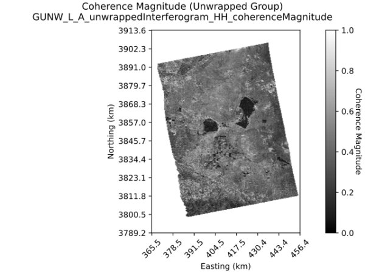

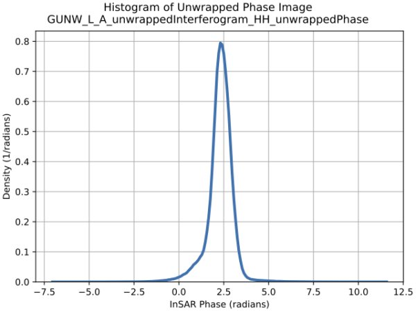

### Wrapped Phase and Wrapped Coherence Magnitude (RIFG, GUNW)

Note: Input GUNW products contain individual coherence magnitude layers for the unwrapped phase image and for the wrapped phase image, at postings matching the corresponding phase image. Both coherence magnitude layers are plotted in the GUNW QA report.

Example Wrapped Phase and Wrapped Coherence Magnitude plots and histograms in the PDF: 

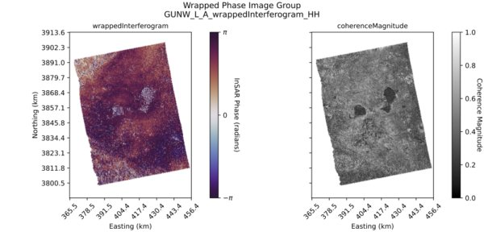

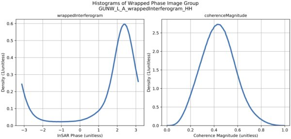

### Ionosphere Phase Screen and Phase Screen Uncertainty (RUNW, GUNW)

Example Ionosphere Phase Screen and Phase Screen Uncertainty plots and histograms in the PDF: 

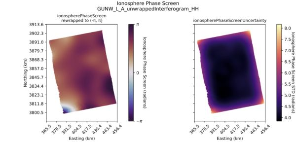

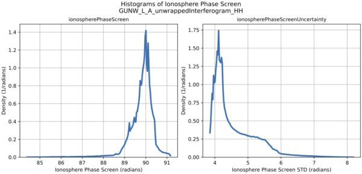

### Along Track Offsets and Slant Range Offsets (RIFG, RUNW, GUNW, ROFF, GOFF)

Example Along Track Offsets and Slant Range Offsets plots and histograms in the PDF: 

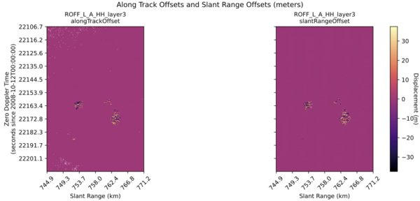

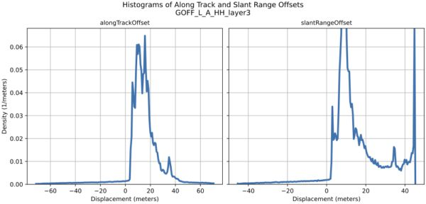

### Combined Pixel Offsets (Quiver Plots) (ROFF, GOFF)

Example Combined Pixel Offsets plot in the PDF: 

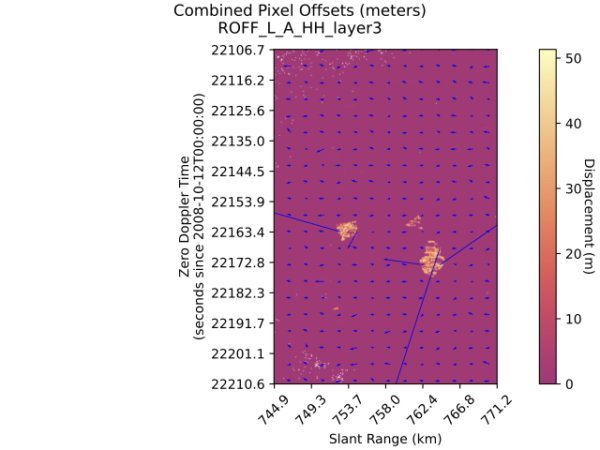

### Cross Offset Variance and Correlation Surface Peak (RIFG, RUNW, GUNW, ROFF, GOFF)

Cross Offset Variance is only available in ROFF and GOFF products. Correlation Surface Peak is available in all RIFG, RUNW, GUNW, ROFF, GOFF products.

Example Cross Offset Variance and Correlation Surface Peak plots and histograms in the PDF: 

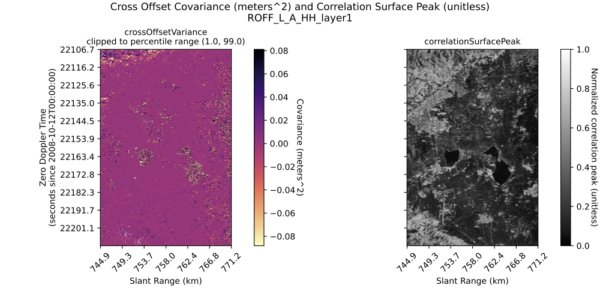

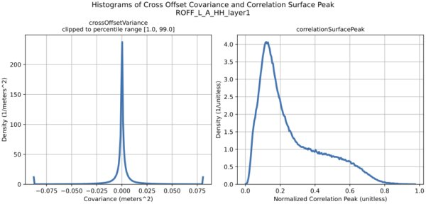

### HSI Image (RIFG, RUNW, GUNW)

For RIFG products, the Hue, Saturation, Intensity (HSI) image is constructed from the wrapped phase raster and the wrapped coherence magnitude raster.

For GUNW and RUNW products, the HSI image is constructed from the unwrapped phase raster 
and the unwrapped coherence magnitude raster.

Example HSI Plot in the PDF: 

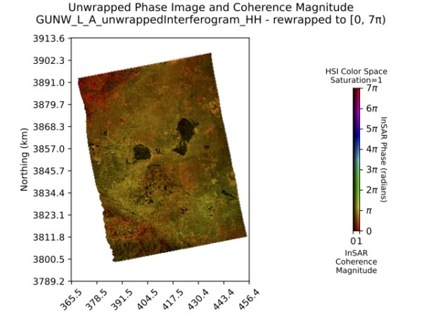

### Along Track and Slant Range Offset Variance (ROFF, GOFF)

Example Along Track and Slant Range Offset Variance plots and histograms in the PDF: 

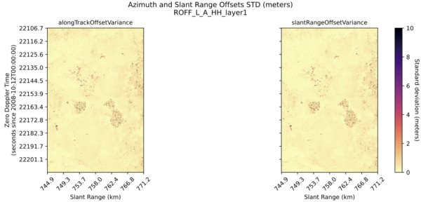

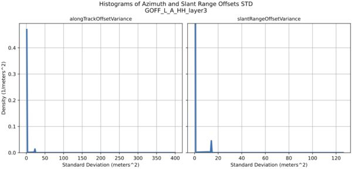

