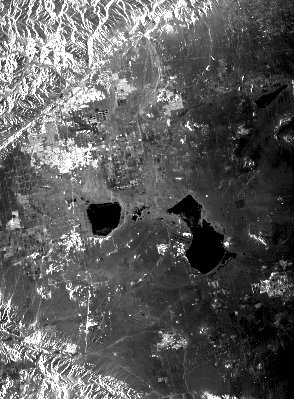
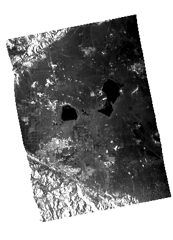
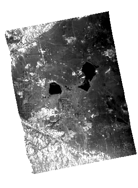
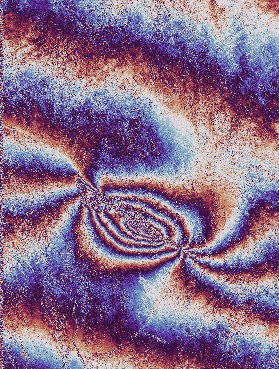
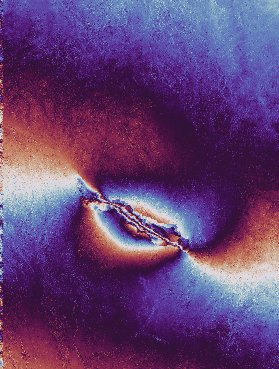
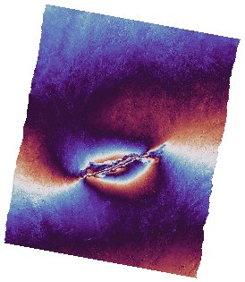
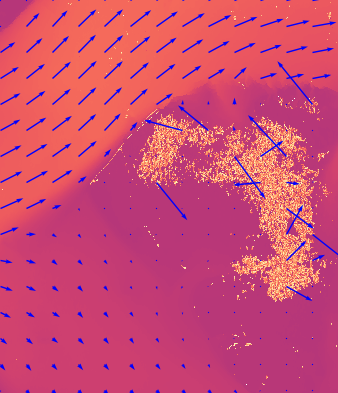
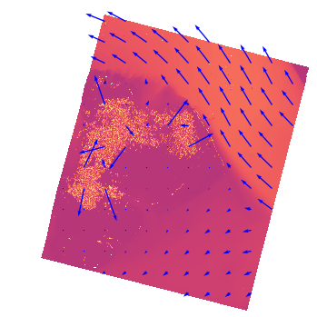

# Browse Products (PNG + KML)

## Overview
The browse images are designed to provide a quick, intuitive representation 
and visualization of the science content of an input L1/L2 granule. 
Their sidecar KML files allow for quick visualization in GIS software. 
During generation of the PNGs, image processing is applied to meets 
these goals; unlike the source L1/L2 science data products, the PNG's 
pixel values should not be used for analysis. 
PNGs are either grayscale or RBGA, with transparency.

Note that during processing, the QA software multilooks and/or decimates 
the original raster from the full-size L1/L2 science granule down to 
the smaller size needed for the browse image PNG. During this reduction, 
best effort is made to so that the pixels in the final PNG are 
"approximately square pixels", meaning that each side of the pixel 
represents approximately the same number of meters on the ground. 
To simplify this reduction, rows and/or columns in the original science data
raster are often truncated.

_Images in this section are from NISAR surrogate data generated
from either ALOS/PALSAR data or from ALOS-2/PALSAR-2 data (as noted). 
The original ALOS/PALSAR data products are provided by JAXA. The original 
ALOS-2/PALSAR-2 data products are provided by JAXA._

## RSLC and GSLC Browse Image
RSLC and GSLC browse images are generated from the SLC image layer(s).
The image layer(s) are multilooked and image processed to produce the 
final PNG; the algorithm used is described in the QA report PDF: Backscatter 
Images section.

RSLC and GSLC browse images are either grayscale or RGBA.
Layer(s) used are selected based on the mode and contents of
the input granule, per the following strategy:

* Single Pol (SP) granules:
    - SP granules contain only one image layer; this will be plotted 
    in grayscale.
* Dual-Pol (DP) and Quasi-Quad (QQ) granules:
    - All image layers for the PNG will come from a single frequency; 
    Frequency A has priority over Frequency B.
    - Within that prioritized frequency, the available co-pol layer 
    ("HH" or "VV") will be assigned to the red and blue channels, and the 
    cross-pol layer ("HV" or "VH") will be assigned to the green channel.
* Quad-Pol (QP) granules:
    - All image layers for the PNG will come from a single frequency; 
    Frequency A has priority over Frequency B.
    - Within that prioritized frequency, the "HH" layer will be assigned to 
    the red channel, the "HV" layer will be assigned to the green channel, 
    and the "VV" layer will be assigned to the  blue channel.
* Quasi-Dual (QD) granules:
    - QD granules have equal bandwiths for Frequency A and Frequency B images, 
    allowing layers across the two frequency groups to be easily combined.
    - From Frequency A, the "HH" layer is assigned to the red and blue channels. 
    From Frequency B, the "VV" layer is assigned to the green channel.
* Compact-Pol (CP) granules:
    - For Frequency A, a grayscale image will be produced for one layer, 
    using prioritization order: ['RH','RV','LH','LV']
* If none of the above cases are met (such as for an off-nominal granule 
configuration), then a grayscale image of one of the available 
image layers is produced.

Reduced-resolution plots of the image layer(s) used to form
the browse image are plotted in the `REPORT.pdf`. Each plot details the
coordinates, colorbar, and more.

Example RSLC Browse Image (reduced size), generated from ALOS/PALSAR data:



Example GSLC Browse Image (reduced size), generated from ALOS/PALSAR data:




## GCOV Browse Image
GCOV browse image are either grayscale or RGBA PNGs. 
Layer(s) used are selected based on the mode and contents of the input granule, 
per the following strategy:

* Only on-diagonal term layers will be used to create the browse image. 
* All image layers for the PNG will come from a single frequency; 
Frequency A has priority over Frequency B. 
* If only one image layer is available, it will be plotted in grayscale.
* If multiple image layers are available, color channels will be assigned 
accordingly to this algorithm:
    - Red channel: first available co-pol term in the list [HHHH, VVVV]
    - Green channel: first in the list [HVHV, VHVH, VVVV]
    - Blue channel:
        - If Green is VVVV, then HHHH is assigned to the blue channel.
        - Else the blue channel is assigned by the first co-pol 
        of the list [VVVV, HHHH].
 * If none of the above cases are met (e.g. GCOVs with only an HVHV term), 
 then a grayscale image of one of the available image layers is produced.

Reduced-resolution plots of the image layer(s) used to form
the browse image are plotted in the `REPORT.pdf`. Each plot details the
coordinates, colorbar, and more.

Example GCOV Browse Image (reduced size), generated from ALOS/PALSAR data:




## RIFG Browse Image
RIFG browse images are RGBA PNGs; they are generated from the Wrapped Phase 
Image Layer.
A reduced-size copy of this image is plotted in the `REPORT.pdf`, 
where details about the coordinates, colorbar, and more can be found.

Example RIFG Browse Image (reduced size), generated from ALOS/PALSAR data:




## RUNW and GUNW Browse Image
RUNW and GUNW browse images are RGBA PNGs; they are generated from the 
Unwrapped Interferogram Layer which has been re-wrapped 
to the interval [0, 7pi). 
A reduced-size copy of this image is plotted in the `REPORT.pdf`, 
where details about the coordinates, colorbar, and more can be found.

Example RUNW Browse Image (reduced size), generated from ALOS/PALSAR data:



Example GUNW Browse Image (reduced size), generated from ALOS/PALSAR data:




## ROFF and GOFF Browse Image
ROFF and GOFF browse images are RGBA PNGs; they are generated by 
combining the Along Track Offsets and Slant Range Offsets layers from 
one of the `layerX` groups (see next paragraph) into a single image, 
overlaid with quiver-plot arrows to for quick visualization of the 
magnitude and direction of movement in the scene.

In the ROFF and GOFF offsets products, there are one or more layer groups 
(e.g. `layer1`, `layer2`, etc.). Each layer group was processed with a 
distinct algorithm combination, which strikes a unique balance between 
the amount of noise and the coarseness of the granularity. 
The priorizitation order for the selecting which layer group to use 
for the browse image is 3, 2, 1, 4, 5, 6, 7.

A reduced-size copy of the browse image is plotted in the `REPORT.pdf`, 
where details about the coordinates, colorbar, additional processing
for the GOFF quiver arrows, and more can be found.

Example ROFF Browse Image (reduced size), generated from ALOS-2/PALSAR-2 data:



Example GOFF Browse Image (reduced size), generated from ALOS-2/PALSAR-2 data:




## KML Description (All Products)

Each browse image PNG is accompanied by a sidecar KML file for 
quick visualization in GIS software.

The KML contains the longitude and latitude coordinates of the four 
corner pixels of the raster layer(s) in the input L1/L2 science granule 
used to generate the browse PNG. 
Due to resizing and truncation while generating the PNG, the four corner 
pixels of the PNG will only approximately align with the four 
longitude/latitude coordinates in the KML; when plotted in GIS software 
this can lead to the PNGs appearing slightly "stretched". This is expected.

Note that for L2 geocoded products, the four longitude/latitude coordinates 
correspond to the four corners of the entire input raster layer, 
which includes the geocoding fill.

QA KML files contain an `<href>` with the relative filepath to the 
corresponding Browse PNG. 
Nominal NISAR KML and Browse PNG files are generated with the assumption
that they will be located in the same directory; the `<href>`
will only contain the basename of the PNG.
If the PNG is moved to a different directory than the KML, and/or if the
PNG is renamed, then the KML must be updated with the new relative filepath
to the PNG.

The four corner points found in the `<gx:LatLonQuad>` are set per 
KML specifications, available at 
https://developers.google.com/kml/documentation/kmlreference#gxlatlonquad. 
Per the specifications, "Exactly four coordinate tuples have to be provided, 
each consisting of floating point values for longitude and latitude. [...] 
The coordinates must be specified in counter-clockwise order with the 
first coordinate corresponding to the lower-left corner of the overlayed image. 
The shape described by these corners must be convex."

Contents of an example RSLC KML file:

```xml
<?xml version="1.0" encoding="UTF-8"?>
<kml xmlns:gx="http://www.google.com/kml/ext/2.2">
  <Document>
    <name>overlay image</name>
    <GroundOverlay>
      <name>overlay image</name>
      <Icon>
        <href>NISAR_L1_PR_RSLC_002_030_A_019_2800_SHNA_A_20081127T061000_20081127T061014_D00404_N_F_J_001.png</href>
      </Icon>
      <gx:LatLonQuad>
        <coordinates>-118.443358591367,35.1738498508456 -117.69035266745301,35.2987616488343 -117.48091814387199,34.4452695936409 -118.227783291052,34.3202637394113</coordinates>
      </gx:LatLonQuad>
    </GroundOverlay>
  </Document>
</kml>
```
