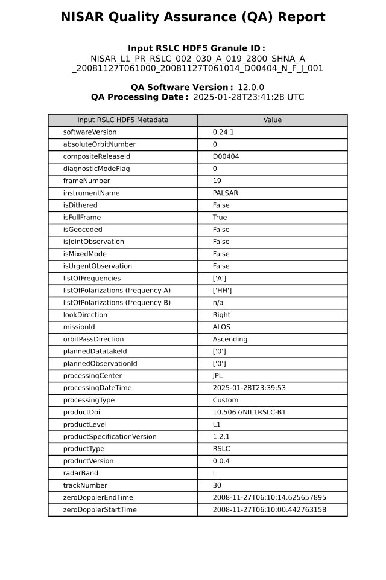

# Graphical Summary (PDF)

The graphical summary PDF is provided to quickly visualize and assess 
the content and quality of an L1 or L2 input granule. 
It includes labeled plots, histograms, and other information 
for the layers and datasets in the input granule.

The processing parameters and computed arrays used to generate the 
histograms, spectra, and other plots in the QA report PDF are stored 
in the QA HDF5 file. This allows users to do analysis algorithmically 
on the computed values seen in the PDFs. Please see Statistical Summary 
(QA HDF5) section in this documentation for details on the datasets 
stored in the QA HDF5 file.

The contents of each PDF are customized for each L1/L2 product type, 
although many features are common to multiple products. 
This section of the documention is organized by product type and 
then by feature. 
The relevant product types noted in parentheses in the subsection titles.

_Images in this section are from NISAR surrogate data generated
from either ALOS/PALSAR data or from ALOS-2/PALSAR-2 data (as noted). 
The original ALOS/PALSAR data products are provided by JAXA. The original 
ALOS-2/PALSAR-2 data products are provided by JAXA._

## Cover Page (All L1/L2 products)

The PDF cover page contains the input's Granule ID, QA software 
version and processing date used to generate the PDF. 
It also reports the majority of the metadata from the input granule's 
`identification` group, with the exception of `boundingPolygon` and other 
datasets whose string-representation length is greater than 30 characters.

The PDF cover page also includes the following metadata:

* `softwareVersion`: The version of the software used to generate the input
L1/L2 granule.
* `listOfPolarizations (frequency A)` and `listOfPolarizations (frequency B)`: 
The list of polarizations available in the input granule per frequency. 
If a given frequency group is not present, this is assigned the value `n/a`. 
* (GCOV only) `listOfCovarianceTerms (frequency A)` and 
`listofCovarianceTerms (frequency B)`: The list of covariance terms 
available in the input granule per frequency. 
If a given frequency group is not present, this is assigned the value `n/a`. 

This additional metadata is parsed from the input granule, but from locations 
outside of the `identification` group.

`boundingPolygon` (and other datasets in the `identification` group whose 
string-representation length is greater than 30 characters) 
will not be displayed.

