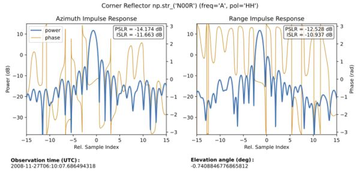
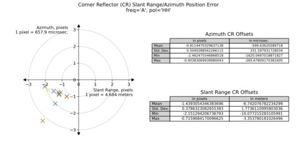

### Calibration Tools (RSLC, GSLC)

Three calibration tools will be run as part of nominal mission processing:
The Noise Equivalent Backscatter (NEB) tool, the Absolute Radiometric 
Calibration (AbsCal) tool, and the Point Target Analysis (PTA) tool.

The NEB tool is run for all RSLC granules.
The PTA and AbsCal tools are run for RSLC and/or GSLC granules over 
designated calibration sites.

#### Noise Equivalent Backscatter (RSLC)

The NEB calibration tool produces a 2-D lookup table which quantifies
the noise for the sensor. It is run by the L1 RSLC focusing workflow 
for all granules, which stores the tool's results in the L1 RSLC HDF5.
For ease of analysis by the users, RSLC QA copies these results 
from the input RSLC HDF5 granule to the RSLC QA HDF5.

#### Absolute Radiometric Calibration tool (RSLC) (Optional)

The AbsCal tool estimates the radiometric calibration error of targets 
with known scattering properties in RSLC granules. It is run by RSLC QA,
and the results are stored in the RSLC QA HDF5.

#### Point Target Analysis Plots (RSLC, GSLC) (Optional)

The PTA tool produces diagnostic plots and metrics 
related to image resolution, sidelobe levels, geometric accuracy, etc. 
in RSLC and GSLC granules. The PTA tool is run by RSLC QA and GSLC QA,
the results are stored in the QA report PDF and QA HDF5.

Impulse response plots display power and phase cross-sections along 
azimuth (along-track) and range (cross-track) of corner reflectors 
in RSLC and GSLC image granules, and provide metrics such as 
Peak-to-Sidelobe Ratio (PSLR) and Integrated Sidelobe Ratio (ISLR) 
for image quality assessment.

Example impulse response plots in the PDF (generated from ALOS/PALSAR data):

Corner reflector (CR) offsets scatterplots in QA reports measure the error 
between expected and apparent positions of surveyed targets in both 
range-Doppler and geocoded image granules in order to calibrate azimuth 
and range delays and evaluate geolocation accuracy.

Example CR offsets scatterplots in the PDF (generated from ALOS/PALSAR data):

