## InSAR and Offsets Products (RIFG, RUNW, GUNW, ROFF, GOFF)

### Unwrapped Phase (RUNW, GUNW)

Example Unwrapped Phase plots and histogram in the PDF 
(generated from ALOS/PALSAR data): 

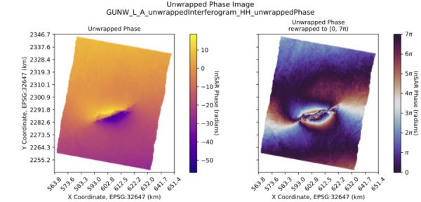

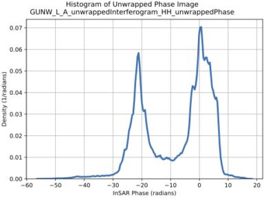

### Connected Components (RUNW, GUNW)

Example Connected Components plot and bar chart in the PDF 
(generated from ALOS/PALSAR data): 

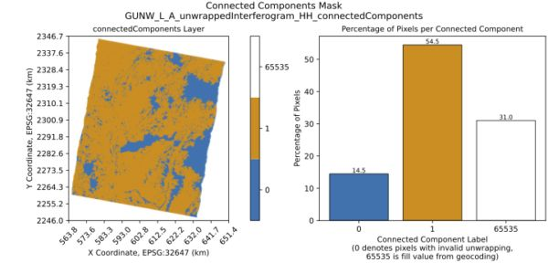

### Unwrapped Coherence Magnitude (RUNW, GUNW)

Example Unwrapped Coherence Magnitude plot and histogram in the PDF 
(generated from ALOS/PALSAR data): 

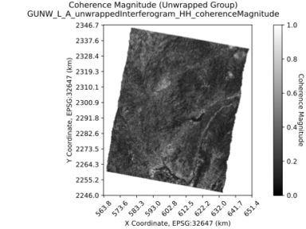

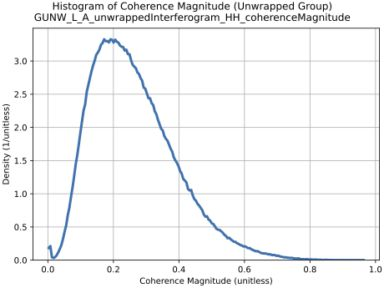

### Wrapped Phase and Wrapped Coherence Magnitude (RIFG, GUNW)

Note: GUNW products contain individual coherence magnitude 
layers for the unwrapped phase image and for the wrapped phase image, 
at postings matching the corresponding phase image. 
Both coherence magnitude layers are plotted in the GUNW QA report PDF.

Example Wrapped Phase and Wrapped Coherence Magnitude plots and 
histograms in the PDF (generated from ALOS/PALSAR data): 

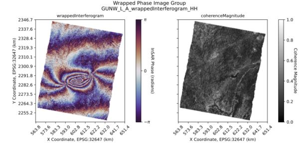

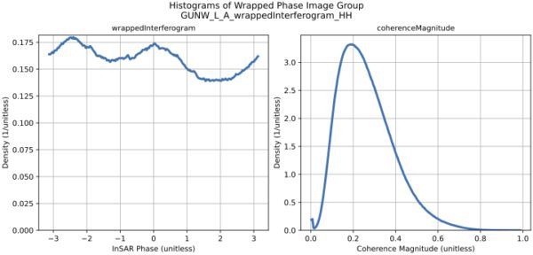

### Ionosphere Phase Screen and Phase Screen Uncertainty (RUNW, GUNW)

Example Ionosphere Phase Screen and Phase Screen Uncertainty plots and 
histograms in the PDF (generated from ALOS/PALSAR data): 

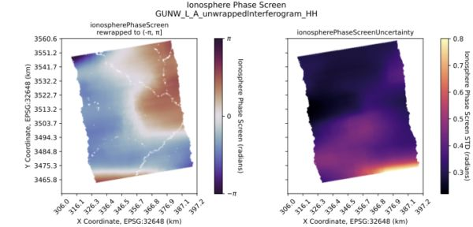

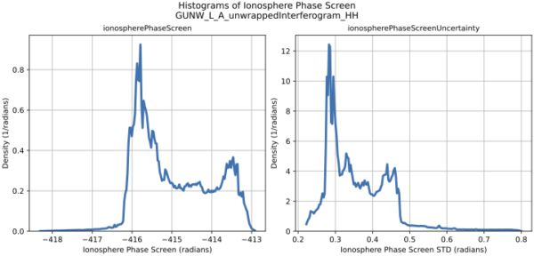

### Along Track Offsets and Slant Range Offsets (RIFG, RUNW, GUNW, ROFF, GOFF)

Example Along Track Offsets and Slant Range Offsets plots and 
histograms in the PDF (generated from ALOS-2/PALSAR-2 data): 

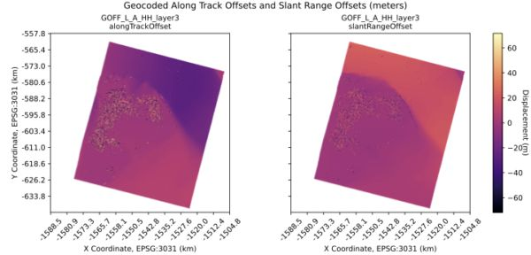

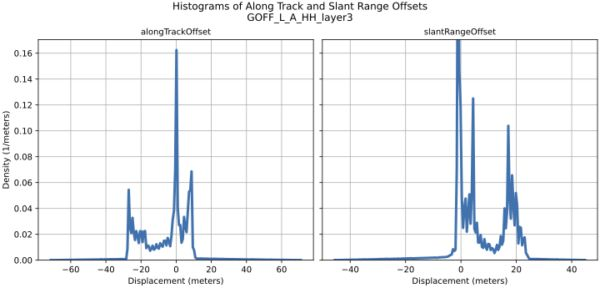

### Combined Azimuth and Slant Range Displacement (Quiver Plots) (ROFF, GOFF)

ROFF: Example Combined Azimuth and Slant Range Displacement plot in the PDF 
(generated from ALOS-2/PALSAR-2 data):

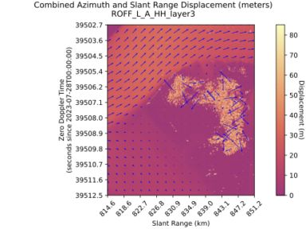

GOFF: Example Combined Azimuth and Slant Range Displacement plot in the PDF 
(generated from ALOS-2/PALSAR-2 data): 

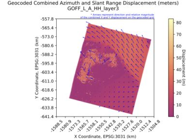

In both ROFF and GOFF products, the Along-Track Offset and Slant-Range 
Offset layers represent displacement in the satellite’s along-track and 
slant range directions, respectively.

For GOFF products, although these layers are geocoded onto a projected 
coordinate grid, their pixel values still represent offsets from the 
satellite’s perspective — that is, in the range-Doppler coordinate system. 
These pixel values do not represent displacements in the projected (map) 
coordinate grid.

Because of this distinction, the quiver plots in the GOFF Browse Image PNG 
and QA PDF products undergo additional processing. Similar to ROFF 
products, the quiver plot background image (and associated colorbar) 
displays the combined displacement magnitude in radar coordinates to 
accurately reflect the underlying offsets layers.

However, for visualization purposes, the GOFF QA SAS applies an additional 
transformation to the quiver arrows so that they indicate the direction 
and relative magnitude of the combined X and Y displacements in projected 
coordinates (i.e., on the geocoded grid).

### Cross Offset Variance and Correlation Surface Peak (RIFG, RUNW, GUNW, ROFF, GOFF)

Cross Offset Variance is only available in ROFF and GOFF products. 
Correlation Surface Peak is available in all RIFG, RUNW, GUNW, ROFF, 
GOFF products.

Example Cross Offset Variance and Correlation Surface Peak plots and 
histograms in the PDF (generated from ALOS-2/PALSAR-2 data): 

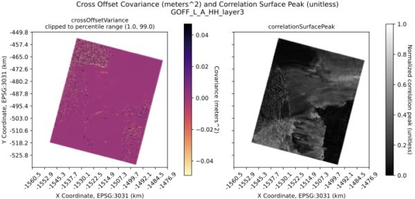

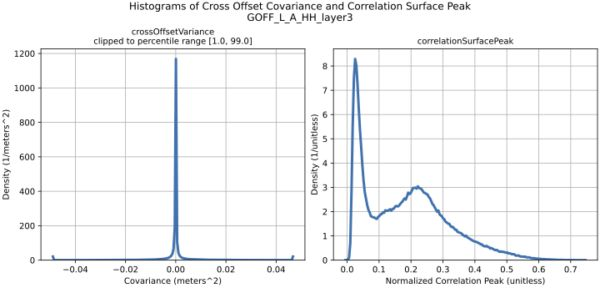

### Along Track and Slant Range Offset Variance (ROFF, GOFF)

Example Along Track and Slant Range Offset Variance plots and 
histograms in the PDF (generated from ALOS-2/PALSAR-2 data): 

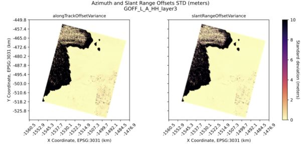

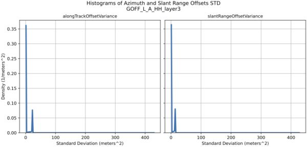

